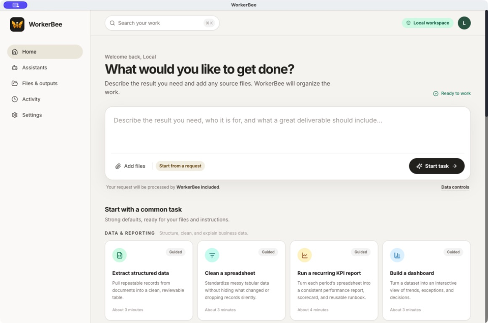
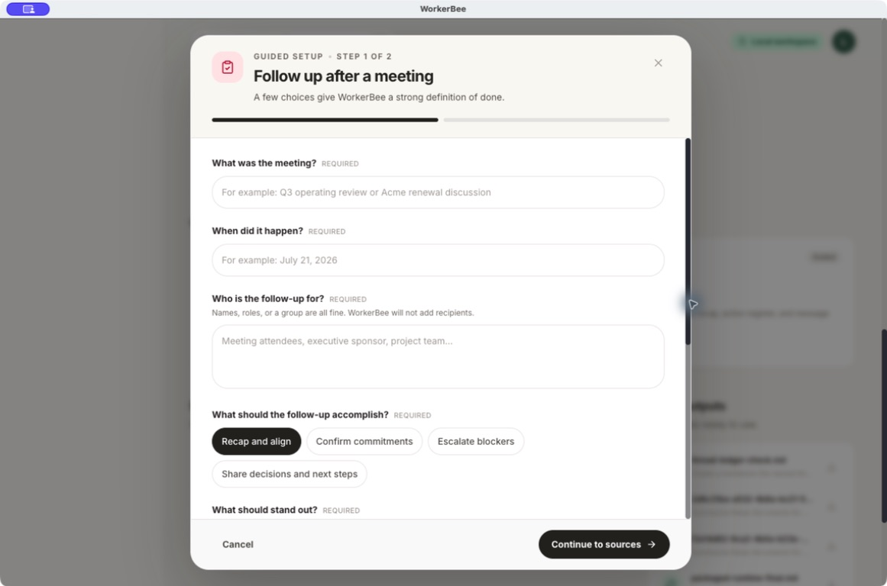

# WorkerBee

## Business work, made genuinely useful

WorkerBee 1.0 turns the work already on your desk—files, meeting notes, spreadsheets,
and open questions—into useful deliverables people can review, use, and share. Start
with the outcome you need, not a prompt-engineering exercise.

- **Move from request to result quickly.** Twelve guided workflows turn familiar jobs
  such as KPI reporting, research synthesis, proposals, presentations, and meeting
  follow-up into clear, reviewable outputs.
- **Keep the evidence visible.** WorkerBee carries filenames, confidence, gaps, and
  source context into the deliverable instead of presenting a polished but opaque answer.
- **Stay in control at the consequential moment.** Email and calendar handoffs are
  editable drafts that require review; WorkerBee never sends, publishes, invites, or
  adds an event on your behalf.
- **Use it where your work lives.** Run it in the browser, or install the desktop app
  without administrator access for local files, native save dialogs, and a private
  loopback-only workspace.

## See WorkerBee 1.0

Start with a plain-language request, add your working files, or choose a guided task
that already knows what a strong deliverable looks like.



Guided setup asks only for the business context that changes the result, then makes the
required sources and review checks explicit before work begins.



WorkerBee 1.0 is an agentic work platform for business users. It combines a polished
web workspace with a no-admin installable desktop app, deterministic output contracts,
and approval at consequential external-action boundaries.

## Current Features

- Twelve guided business workflows across data and reporting, briefs and decisions,
  research and analysis, presentations, proposals, project updates, and meetings
- Grounded multi-file deliverables with deterministic Markdown, CSV, spreadsheet,
  presentation, and HTML rendering where the workflow requires it
- A searchable Home, immutable task and revision history, live activity, artifact
  previews, and clear missing-input recovery
- A source Library with collections, exact saved source sets, bounded ZIP export, and
  precise handoff into new work
- Approval-gated email and tentative calendar draft handoffs that never send, publish,
  invite, or add an event automatically
- Browser deployment backed by PostgreSQL, Redis, MinIO, and OpenCode
- A macOS/Windows/Linux Electron app with a bundled loopback-only FastAPI/SQLite runtime,
  native file dialogs, encrypted provider credentials, and no administrator requirement
- A versioned desktop runtime contract that prevents a new UI from launching with a
  stale or capability-incompatible local backend

## Architecture

```text
┌──────────────────────────────────────────────────────────────┐
│ Frontend                                                     │
│ React 18 + TypeScript + Vite + TailwindCSS + TanStack Query  │
│ Routes: Home, Work, Library, Activity, Assistants, Settings   │
└───────────────────────────────┬──────────────────────────────┘
                                │ /api/v1
┌───────────────────────────────▼──────────────────────────────┐
│ Backend                                                       │
│ FastAPI + SQLAlchemy async + PostgreSQL + Redis + MinIO       │
│ Auth, agents, files, resource groups, executions, outputs     │
└───────────────┬───────────────────────────────────┬──────────┘
                │                                   │
                │ OpenCode HTTP API                 │ shared volumes
┌───────────────▼──────────────┐       ┌────────────▼───────────┐
│ OpenCode server               │       │ Storage and state       │
│ opencode serve on port 4096   │       │ PostgreSQL, Redis, MinIO│
│ workspace: /workspace         │       │ uploads and artifacts   │
└───────────────────────────────┘       └────────────────────────┘
```

The backend creates an OpenCode session for each execution, prepares an isolated
workspace, copies the exact approved inputs, validates workflow-specific output
contracts, and records logs and artifacts. In the desktop app the same API runs as a
bundled loopback-only sidecar against a per-user SQLite workspace; source files and
deliverables stay on the local machine unless the user explicitly approves model
processing.

## Tech Stack

### Frontend

- React 18 with TypeScript
- Vite development server with `/api` proxying
- TailwindCSS
- TanStack Query
- Axios API client with access-token refresh handling
- React Router
- Lucide icons, Radix UI packages, React Markdown, and Mermaid

### Backend

- FastAPI on Python 3.11
- SQLAlchemy async with PostgreSQL
- Pydantic v2 settings and schemas
- JWT authentication with `python-jose`
- MinIO-compatible object storage
- Redis dependency configured for cache/task infrastructure
- OpenCode HTTP client for agent execution
- liteLLM, LangChain, and LangGraph dependencies are still present, but current agent execution is routed through OpenCode

### Local Infrastructure

- Docker Compose for local development
- PostgreSQL 15
- Redis 7
- MinIO
- Backend API container
- Frontend Vite container
- OpenCode server container

## Getting Started

### Prerequisites

- Docker and Docker Compose
- Node.js 20+ for running the frontend outside Docker
- Python 3.11+ for running the backend outside Docker

### Quick Start With Docker

1. Create the environment file:

   ```bash
   cp .env.example .env
   ```

2. Set at least one model provider key in `.env`. The Compose OpenCode service defaults OpenAI and Anthropic compatible base URLs to OpenRouter:

   ```env
   OPENROUTER_API_KEY=...
   OPENAI_API_KEY=...
   ANTHROPIC_API_KEY=...
   ```

   Use the variables that match the provider you intend OpenCode to call.

3. Start the stack:

   ```bash
   docker compose up -d
   ```

4. Open the services:

   - Frontend: <http://localhost:5173>
   - Backend health check: <http://localhost:8000/health>
   - API docs: <http://localhost:8000/api/v1/docs>
   - API OpenAPI JSON: <http://localhost:8000/api/v1/openapi.json>
   - MinIO console: <http://localhost:9001>
   - OpenCode server: <http://localhost:4096>

The frontend container is configured with `VITE_API_URL=http://backend:8000`; the browser client normalizes that internal Docker hostname to same-origin `/api/v1`, and Vite proxies `/api` to the backend.

### Installable desktop app

WorkerBee's desktop package does not need administrator access. It bundles the web UI,
the local API, SQLite persistence, and the native OpenCode engine. On first launch the
user selects included model access or enters a provider credential, which is stored with
the operating system's encrypted storage. Native dialogs can attach local files and save
finished deliverables back to an explicit user-selected location.

Build a native package on the operating system it targets:

```bash
npm --prefix desktop run dist:mac
npm --prefix desktop run dist:windows
npm --prefix desktop run dist:linux
```

PyInstaller and OpenCode are host-native, so releases cannot be cross-compiled. The
repeatable native matrix is in `.github/workflows/desktop-packages.yml`; the complete
release gate is documented in `plans/desktop-release-checklist.md`.

### Local Frontend Development

```bash
cd frontend
npm install
npm run dev
```

By default, Vite serves on `0.0.0.0:5173` and proxies `/api` to `http://localhost:8000` unless `VITE_API_URL` is set.

### Local Backend Development

```bash
cd backend
pip install -e ".[dev]"
uvicorn app.main:app --reload
```

For local backend execution outside Docker, provide PostgreSQL, Redis, MinIO, and OpenCode settings that point at reachable services.

## Project Structure

```text
workerbee/
├── backend/
│   ├── app/
│   │   ├── agent/              # OpenCode-backed execution orchestration
│   │   ├── routers/            # FastAPI route modules
│   │   ├── auth.py             # Authentication helpers
│   │   ├── config.py           # Environment-driven settings
│   │   ├── database.py         # Async SQLAlchemy setup
│   │   ├── main.py             # FastAPI application
│   │   ├── models.py           # SQLAlchemy models
│   │   ├── opencode_client.py  # OpenCode HTTP client
│   │   └── schemas.py          # Pydantic schemas
│   ├── Dockerfile
│   └── pyproject.toml
├── frontend/
│   ├── src/
│   │   ├── components/
│   │   ├── lib/api.ts          # Axios client and typed API helpers
│   │   ├── pages/
│   │   ├── App.tsx
│   │   └── main.tsx
│   ├── Dockerfile.dev
│   ├── package.json
│   └── vite.config.ts
├── opencode/
│   ├── Dockerfile              # Runs opencode serve on port 4096
│   ├── opencode.json           # OpenCode server configuration
│   └── package.json
├── docker-compose.yml
├── .env.example
└── README.md
```

## API Overview

All application API routes are under `/api/v1`.

### Authentication

- `POST /api/v1/auth/register`
- `POST /api/v1/auth/login`
- `POST /api/v1/auth/refresh`
- `GET /api/v1/auth/me`

### Agents

- `GET /api/v1/agents/types`
- `GET /api/v1/agents/templates`
- `GET /api/v1/agents`
- `POST /api/v1/agents`
- `POST /api/v1/agents/from-template`
- `GET /api/v1/agents/{agent_id}`
- `PUT /api/v1/agents/{agent_id}`
- `DELETE /api/v1/agents/{agent_id}`
- `POST /api/v1/agents/{agent_id}/run`
- `GET /api/v1/agents/{agent_id}/resources`
- `PUT /api/v1/agents/{agent_id}/resources`
- `DELETE /api/v1/agents/{agent_id}/resources/{file_id}`

### Files and Resource Groups

- `GET /api/v1/files`
- `POST /api/v1/files/upload`
- `GET /api/v1/files/{file_id}`
- `GET /api/v1/files/{file_id}/download`
- `DELETE /api/v1/files/{file_id}`
- `GET /api/v1/files/resource-groups`
- `POST /api/v1/files/resource-groups`
- `GET /api/v1/files/resource-groups/{resource_group_id}/files`
- `DELETE /api/v1/files/resource-groups/{resource_group_id}`
- `PUT /api/v1/files/{file_id}/resource-group`

### Executions and Outputs

- `GET /api/v1/executions`
- `POST /api/v1/executions`
- `GET /api/v1/executions/{execution_id}`
- `PUT /api/v1/executions/{execution_id}`
- `POST /api/v1/executions/{execution_id}/cancel`
- `GET /api/v1/executions/{execution_id}/stream`
- `GET /api/v1/executions/{execution_id}/logs`
- `GET /api/v1/outputs`
- `POST /api/v1/outputs`
- `GET /api/v1/outputs/types`
- `GET /api/v1/outputs/recent-files`
- `GET /api/v1/outputs/recent-files/{artifact_id}/download`
- `GET /api/v1/outputs/{output_id}`
- `PUT /api/v1/outputs/{output_id}`
- `DELETE /api/v1/outputs/{output_id}`

### Workflows, Tasks, and Users

- `GET /api/v1/workflows`
- `POST /api/v1/workflows`
- `GET /api/v1/workflows/{workflow_id}`
- `PUT /api/v1/workflows/{workflow_id}`
- `DELETE /api/v1/workflows/{workflow_id}`
- `POST /api/v1/workflows/{workflow_id}/nodes`
- `POST /api/v1/workflows/{workflow_id}/edges`
- `GET /api/v1/tasks`
- `POST /api/v1/tasks`
- `GET /api/v1/tasks/templates`
- `GET /api/v1/tasks/{task_id}`
- `PUT /api/v1/tasks/{task_id}`
- `DELETE /api/v1/tasks/{task_id}`
- `GET /api/v1/users`
- `GET /api/v1/users/{user_id}`

## Configuration

Important active settings:

| Variable | Description | Code default / Docker Compose value |
| --- | --- | --- |
| `DATABASE_URL` | PostgreSQL async connection URL | Localhost code default / `postgres:5432` in Compose |
| `REDIS_URL` | Redis connection URL | Localhost code default / `redis:6379` in Compose |
| `SECRET_KEY` | JWT signing key | Development placeholder / Compose placeholder |
| `MINIO_ENDPOINT` | MinIO API endpoint | `localhost:9000` / `minio:9000` |
| `MINIO_ACCESS_KEY` | MinIO access key | `minioadmin` |
| `MINIO_SECRET_KEY` | MinIO secret key | `minioadmin` / `minioadmin_secret` |
| `MINIO_BUCKET` | MinIO bucket name | `workerbee` |
| `MINIO_SECURE` | Use HTTPS for MinIO | `false` |
| `OPENCODE_API_BASE_URL` | Backend-to-OpenCode URL | `http://opencode:4096` |
| `OPENCODE_PASSWORD` | Basic auth password for OpenCode server | `workerbee_secret` |
| `OPENCODE_WORKSPACE_ROOT` | Shared execution workspace root | `/workspace` |
| `LLM_AVAILABLE_MODELS` | Comma-separated model IDs shown/allowed in UI settings | Built-in model list / `.env` override supported |
| `LLM_DEFAULT_MODEL` | Default model ID for UI settings | `anthropic/claude-3-5-sonnet-20241022` / `.env` override supported |
| `MAX_FILE_SIZE` | Max upload size in bytes | `104857600` |

`docker-compose.yml` still passes several `SANDBOX_*` variables into the backend for compatibility with older configuration, but the current backend settings and execution path use `OPENCODE_*` settings and `backend/app/opencode_client.py`.

OpenCode provider configuration is controlled by the `opencode` service environment and `opencode/opencode.json`. The Compose file exposes:

- `OPENAI_API_KEY`
- `OPENAI_BASE_URL`
- `ANTHROPIC_API_KEY`
- `ANTHROPIC_BASE_URL`
- `OPENCODE_SERVER_PASSWORD`

## Notes

- Generated execution workspaces are created under the shared `opencode_workspace` Docker volume at `/workspace/executions/{execution_id}`.
- Uploaded files are stored under the backend upload path and associated with resource groups.
- API documentation is served at `/api/v1/docs`, not `/docs`.
- The repository currently contains development helper scripts such as `check_db.py` and output inspection scripts; they are not required for normal startup.

## License

MIT License - see `LICENSE` if present.
