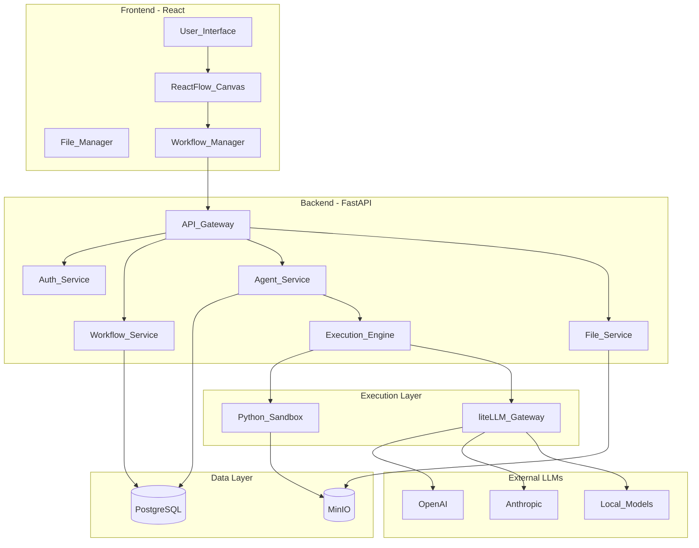
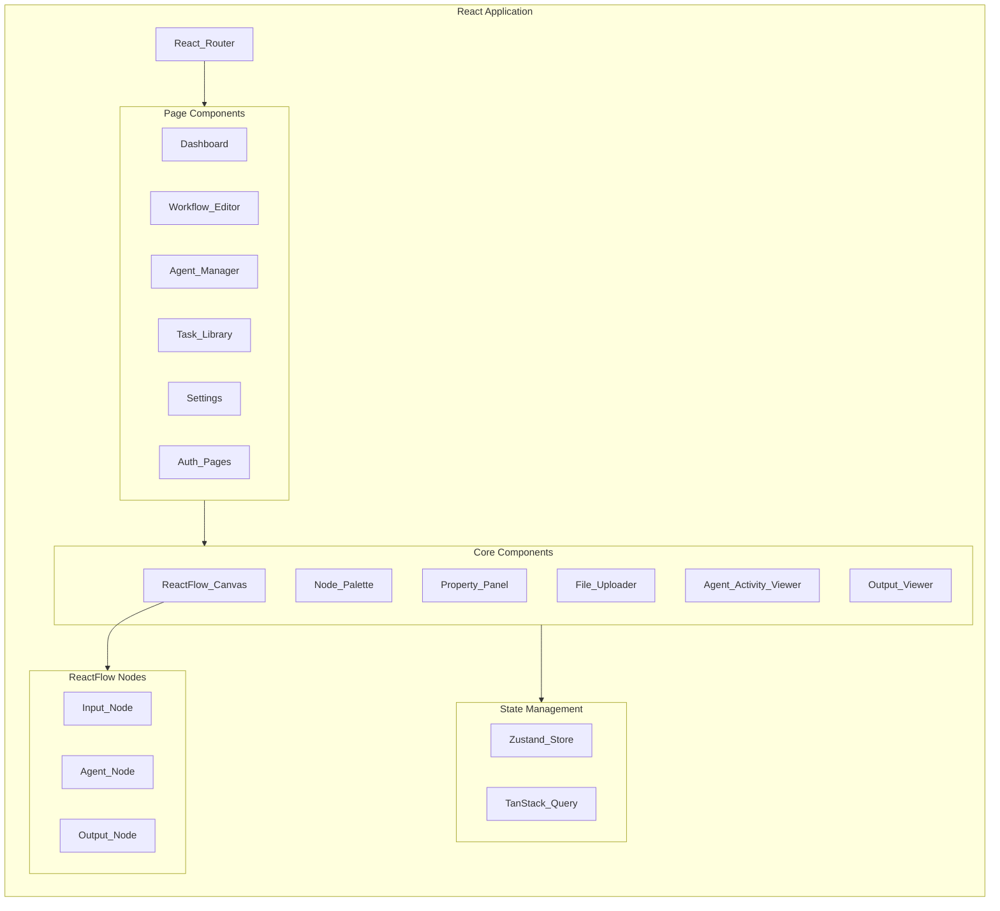
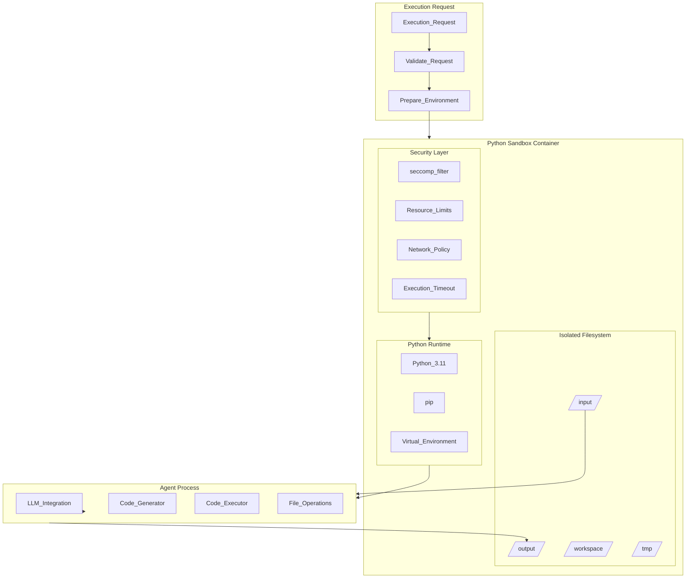
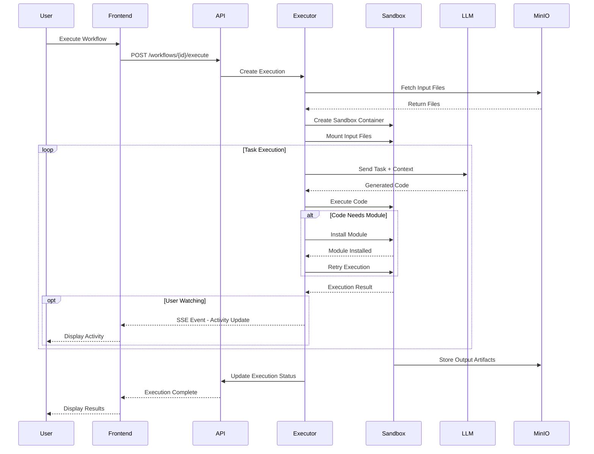
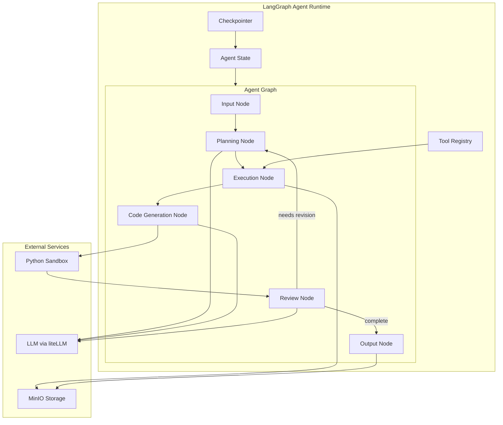
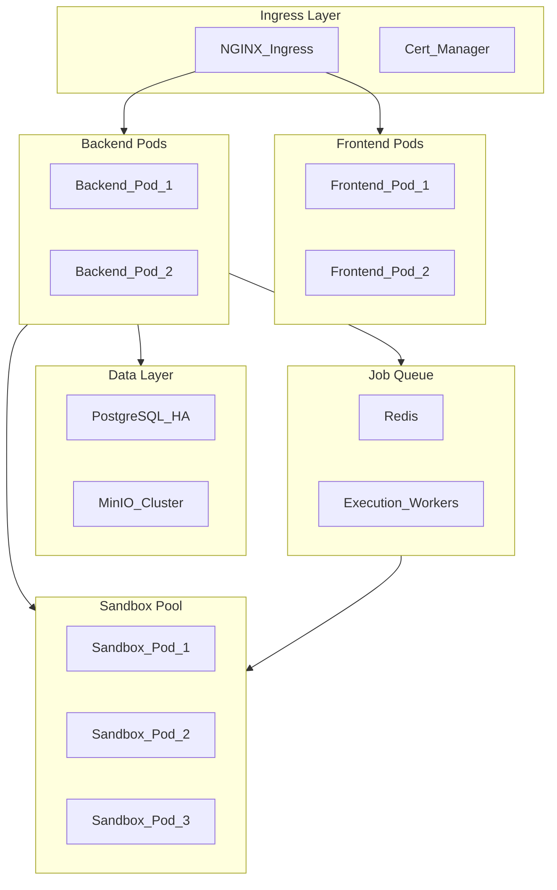

# WorkerBee Architecture Plan

## Executive Summary

WorkerBee is a visual agent platform that enables non-technical users to accomplish real-world work tasks using AI agents. Users can create workflows by connecting input data sources to agents, which process the data and produce outputs. The platform provides a visual, node-based interface using ReactFlow for intuitive workflow design.

---

## 1. System Overview

### 1.1 Core Concepts

| Concept | Description |
|---------|-------------|
| **Input Data** | User-uploaded files (PDF, Word, Excel, PowerPoint, CSV, images) that feed into agents |
| **Agent** | An AI-powered worker that executes tasks using LLMs and Python code execution |
| **Task** | Instructions/prompt given to an agent describing what work to accomplish |
| **Output** | Artifacts produced by agents (Word documents, reports, CSV, Excel files) |
| **Workflow** | A visual graph connecting inputs → agent → outputs |

### 1.2 High-Level Architecture



---

## 2. Component Architecture

### 2.1 Frontend Architecture



### 2.2 Backend Architecture

```mermaid
flowchart TB
    subgraph FastAPI [FastAPI Application]
        subgraph Routes [API Routes]
            AuthR[auth_routes]
            UserR[users_routes]
            WorkflowR[workflows_routes]
            AgentR[agents_routes]
            TaskR[tasks_routes]
            FileR[files_routes]
            OutputR[outputs_routes]
            SettingsR[settings_routes]
        end
        
        subgraph Services [Business Logic]
            AuthService[Authentication_Service]
            UserService[User_Service]
            WorkflowService[Workflow_Service]
            AgentService[Agent_Service]
            TaskService[Task_Service]
            FileService[File_Service]
            ExecutionService[Execution_Service]
            SandboxService[Sandbox_Service]
        end
        
        subgraph Models [Data Models]
            UserM[User_Model]
            WorkflowM[Workflow_Model]
            AgentM[Agent_Model]
            TaskM[Task_Model]
            FileM[File_Model]
            OutputM[Output_Model]
        end
        
        subgraph External [External Integrations]
            LiteLLM[liteLLM_Client]
            MinioClient[MinIO_Client]
            PostgresClient[PostgreSQL_Client]
        end
    end
    
    Routes --> Services
    Services --> Models
    Services --> External
```



---

## 3. Database Schema

### 3.1 Entity Relationship Diagram

```mermaid
erDiagram
    users ||--o{ workflows : creates
    users ||--o{ agents : creates
    users ||--o{ tasks : creates
    users ||--o{ files : uploads
    users ||--o{ outputs : owns
    users ||--o{ api_keys : has
    
    workflows ||--o{ workflow_nodes : contains
    workflows ||--o{ workflow_edges : contains
    workflows ||--o{ executions : triggers
    
    workflow_nodes }o--|| files : references
    workflow_nodes }o--|| agents : references
    workflow_nodes }o--|| outputs : references
    
    agents }o--|| agent_types : uses
    agents ||--o{ executions : runs
    
    tasks ||--o{ executions : uses
    
    executions ||--o{ execution_logs : generates
    executions ||--o{ artifacts : produces
    
    outputs ||--o{ artifacts : contains
    
    USERS {
        uuid id PK
        string email UK
        string password_hash
        string full_name
        boolean is_active
        boolean is_superuser
        timestamp created_at
        timestamp updated_at
    }
    
    API_KEYS {
        uuid id PK
        uuid user_id FK
        string provider
        string encrypted_key
        timestamp created_at
    }
    
    WORKFLOWS {
        uuid id PK
        uuid user_id FK
        string name
        text description
        jsonb canvas_state
        boolean is_active
        timestamp created_at
        timestamp updated_at
    }
    
    WORKFLOW_NODES {
        uuid id PK
        uuid workflow_id FK
        string node_type
        uuid reference_id
        jsonb position
        jsonb config
        timestamp created_at
    }
    
    WORKFLOW_EDGES {
        uuid id PK
        uuid workflow_id FK
        uuid source_node_id FK
        uuid target_node_id FK
        jsonb edge_config
        timestamp created_at
    }
    
    FILES {
        uuid id PK
        uuid user_id FK
        string filename
        string original_filename
        string content_type
        bigint file_size
        string storage_path
        string file_type
        timestamp created_at
    }
    
    AGENTS {
        uuid id PK
        uuid user_id FK
        uuid agent_type_id FK
        string name
        text description
        jsonb config
        jsonb llm_settings
        boolean is_active
        timestamp created_at
        timestamp updated_at
    }
    
    AGENT_TYPES {
        uuid id PK
        string name
        string provider
        string model_name
        text description
        jsonb default_config
        boolean is_active
    }
    
    TASKS {
        uuid id PK
        uuid user_id FK
        string name
        text description
        text prompt_template
        boolean is_template
        boolean is_public
        timestamp created_at
    }
    
    EXECUTIONS {
        uuid id PK
        uuid workflow_id FK
        uuid agent_id FK
        uuid task_id FK
        string status
        timestamp started_at
        timestamp completed_at
        integer duration_ms
        jsonb result
        text error_message
    }
    
    EXECUTION_LOGS {
        uuid id PK
        uuid execution_id FK
        string log_type
        text message
        jsonb metadata
        timestamp created_at
    }
    
    ARTIFACTS {
        uuid id PK
        uuid execution_id FK
        uuid output_id FK
        string filename
        string content_type
        bigint file_size
        string storage_path
        timestamp created_at
    }
    
    OUTPUTS {
        uuid id PK
        uuid user_id FK
        string name
        string output_type
        jsonb config
        timestamp created_at
    }
```



### 3.2 Key Database Tables

#### Users & Authentication
- `users` - User accounts with authentication details
- `api_keys` - Encrypted API keys for LLM providers

#### Workflow Management
- `workflows` - Saved workflow configurations
- `workflow_nodes` - Individual nodes in a workflow canvas
- `workflow_edges` - Connections between nodes

#### Core Objects
- `files` - Uploaded input files with metadata
- `agents` - Agent configurations
- `agent_types` - Pre-defined agent templates
- `tasks` - Task definitions and templates
- `outputs` - Output configurations

#### Execution & Logging
- `executions` - Execution records
- `execution_logs` - Detailed execution logs for activity viewing
- `artifacts` - Generated output files

---

## 4. API Design

### 4.1 RESTful API Endpoints

#### Authentication
```
POST   /api/v1/auth/register          - Register new user
POST   /api/v1/auth/login             - Login user
POST   /api/v1/auth/logout            - Logout user
POST   /api/v1/auth/refresh           - Refresh access token
GET    /api/v1/auth/me                - Get current user
```

#### Users
```
GET    /api/v1/users                  - List users (admin)
GET    /api/v1/users/{id}             - Get user details
PUT    /api/v1/users/{id}             - Update user
DELETE /api/v1/users/{id}             - Delete user
```

#### Workflows
```
GET    /api/v1/workflows              - List user workflows
POST   /api/v1/workflows              - Create workflow
GET    /api/v1/workflows/{id}         - Get workflow details
PUT    /api/v1/workflows/{id}         - Update workflow
DELETE /api/v1/workflows/{id}         - Delete workflow
POST   /api/v1/workflows/{id}/execute - Execute workflow
```

#### Files
```
GET    /api/v1/files                  - List user files
POST   /api/v1/files/upload           - Upload file
GET    /api/v1/files/{id}             - Get file metadata
GET    /api/v1/files/{id}/download    - Download file
DELETE /api/v1/files/{id}             - Delete file
```

#### Agents
```
GET    /api/v1/agents                 - List user agents
POST   /api/v1/agents                 - Create agent
GET    /api/v1/agents/{id}            - Get agent details
PUT    /api/v1/agents/{id}            - Update agent
DELETE /api/v1/agents/{id}            - Delete agent
GET    /api/v1/agent-types            - List available agent types
```

#### Tasks
```
GET    /api/v1/tasks                  - List tasks
POST   /api/v1/tasks                  - Create task
GET    /api/v1/tasks/{id}             - Get task details
PUT    /api/v1/tasks/{id}             - Update task
DELETE /api/v1/tasks/{id}             - Delete task
GET    /api/v1/tasks/templates        - List task templates
```

#### Outputs
```
GET    /api/v1/outputs                - List outputs
POST   /api/v1/outputs                - Create output
GET    /api/v1/outputs/{id}           - Get output details
PUT    /api/v1/outputs/{id}           - Update output
DELETE /api/v1/outputs/{id}           - Delete output
GET    /api/v1/outputs/{id}/artifacts - List output artifacts
GET    /api/v1/outputs/{id}/download  - Download all artifacts
```

#### Executions
```
GET    /api/v1/executions             - List executions
GET    /api/v1/executions/{id}        - Get execution details
GET    /api/v1/executions/{id}/logs   - Get execution logs (SSE)
POST   /api/v1/executions/{id}/cancel - Cancel execution
```

#### Settings
```
GET    /api/v1/settings               - Get user settings
PUT    /api/v1/settings               - Update user settings
GET    /api/v1/settings/llm-providers - List LLM providers
POST   /api/v1/settings/api-keys      - Add API key
PUT    /api/v1/settings/api-keys/{id} - Update API key
DELETE /api/v1/settings/api-keys/{id} - Delete API key
```

### 4.2 WebSocket/SSE Endpoints

```
GET    /api/v1/ws/executions/{id}     - Real-time execution updates
GET    /api/v1/executions/{id}/stream - SSE stream for agent activity
```

---

## 5. Agent Execution Architecture

### 5.1 Sandbox Architecture



### 5.2 Agent Execution Flow



### 5.3 Sandbox Security Model

| Security Measure | Implementation |
|-----------------|----------------|
| **Process Isolation** | Docker containers with dedicated cgroups |
| **Filesystem Isolation** | Read-only base image + tmpfs for workspace |
| **Network Isolation** | No external network access except LLM API |
| **Resource Limits** | CPU: 2 cores, Memory: 4GB, Disk: 10GB |
| **Execution Timeout** | Configurable, default 30 minutes |
| **Module Installation** | Allowed from PyPI only, cached locally |
| **Code Validation** | AST analysis before execution |

### 5.4 LangGraph Agent Framework

WorkerBee uses LangGraph as the agent orchestration framework. LangGraph provides stateful, cyclic agent workflows with built-in persistence and human-in-the-loop capabilities.

#### Architecture Overview



#### LangGraph Node Types

| Node | Purpose | Actions |
|------|---------|---------|
| **Input Node** | Receive and validate input files | Load files from MinIO, parse content, update state |
| **Planning Node** | Analyze task and create execution plan | Call LLM to generate step-by-step plan |
| **Execution Node** | Execute planned steps | Invoke tools, manage file operations |
| **Code Generation Node** | Generate Python code | Call LLM to write code, validate syntax |
| **Review Node** | Evaluate results | Check output quality, decide on revisions |
| **Output Node** | Generate final artifacts | Create output files, store in MinIO |

#### Agent State Schema

```python
from typing import TypedDict, List, Optional
from langgraph.graph import StateGraph

class AgentState(TypedDict):
    # Task information
    task_id: str
    task_prompt: str
    
    # Input files
    input_files: List[dict]
    parsed_content: dict
    
    # Execution state
    current_step: str
    execution_plan: List[str]
    completed_steps: List[str]
    
    # Code execution
    generated_code: Optional[str]
    code_output: Optional[str]
    execution_errors: List[str]
    
    # Output
    output_artifacts: List[dict]
    
    # Control flow
    revision_count: int
    max_revisions: int
    needs_revision: bool
    is_complete: bool
    
    # Metadata
    started_at: str
    updated_at: str
```

#### Key LangGraph Features Used

1. **Stateful Execution**: Agent maintains state across all nodes, enabling complex multi-step workflows
2. **Cyclic Graphs**: Review node can route back to Planning node for iterative refinement
3. **Checkpointing**: State persistence allows pausing/resuming executions and recovery from failures
4. **Human-in-the-loop**: Optional approval steps before code execution or final output
5. **Streaming**: Real-time state updates streamed to frontend via SSE

#### Tool Integration

```python
from langgraph.prebuilt import ToolNode

# Tools available to agents
tools = [
    # File operations
    read_file,
    write_file,
    list_files,
    
    # Code execution
    execute_python,
    install_package,
    
    # Data processing
    parse_pdf,
    parse_excel,
    parse_csv,
    parse_image,
    
    # Output generation
    create_word_doc,
    create_excel,
    create_csv,
    create_pdf,
]

tool_node = ToolNode(tools)
```

---

## 6. Frontend Component Structure

### 6.1 Directory Structure

```
frontend/
├── src/
│   ├── app/
│   │   ├── App.tsx
│   │   ├── Router.tsx
│   │   └── Providers.tsx
│   ├── pages/
│   │   ├── Dashboard/
│   │   ├── WorkflowEditor/
│   │   ├── AgentManager/
│   │   ├── TaskLibrary/
│   │   ├── Settings/
│   │   └── Auth/
│   ├── components/
│   │   ├── common/
│   │   │   ├── Button/
│   │   │   ├── Input/
│   │   │   ├── Modal/
│   │   │   ├── Card/
│   │   │   └── Table/
│   │   ├── workflow/
│   │   │   ├── Canvas/
│   │   │   ├── NodePalette/
│   │   │   ├── PropertyPanel/
│   │   │   └── Toolbar/
│   │   ├── nodes/
│   │   │   ├── InputNode/
│   │   │   ├── AgentNode/
│   │   │   └── OutputNode/
│   │   ├── agent/
│   │   │   ├── AgentViewer/
│   │   │   ├── AgentConfig/
│   │   │   └── ActivityLog/
│   │   └── file/
│   │       ├── FileUploader/
│   │       ├── FileList/
│   │       └── FilePreview/
│   ├── hooks/
│   │   ├── useWorkflow/
│   │   ├── useAgent/
│   │   ├── useExecution/
│   │   └── useSSE/
│   ├── stores/
│   │   ├── workflowStore.ts
│   │   ├── agentStore.ts
│   │   └── uiStore.ts
│   ├── services/
│   │   ├── api/
│   │   ├── websocket/
│   │   └── storage/
│   ├── types/
│   │   ├── workflow.ts
│   │   ├── agent.ts
│   │   ├── task.ts
│   │   └── file.ts
│   └── utils/
│       ├── validation/
│       ├── formatting/
│       └── constants/
├── public/
├── package.json
└── vite.config.ts
```

### 6.2 Key ReactFlow Nodes

#### Input Node
```typescript
interface InputNodeData {
  fileId: string;
  fileName: string;
  fileType: string;
  fileSize: number;
  preview?: string;
}
```

#### Agent Node
```typescript
interface AgentNodeData {
  agentId: string;
  agentName: string;
  agentType: string;
  task: Task;
  llmModel: string;
  status: idle | running | completed | error;
  config: AgentConfig;
}
```

#### Output Node
```typescript
interface OutputNodeData {
  outputId: string;
  outputName: string;
  outputType: OutputType;
  artifacts: Artifact[];
  config: OutputConfig;
}
```

---

## 7. Pre-Defined Options

### 7.1 Agent Types

| Agent Type | Model | Best For |
|-----------|-------|----------|
| **General Purpose** | GPT-4o | General tasks, analysis, writing |
| **Code Specialist** | Claude 3.5 Sonnet | Code generation, data processing |
| **Fast Worker** | GPT-4o-mini | Quick tasks, simple operations |
| **Document Expert** | Claude 3.5 Sonnet | PDF/Word analysis, summarization |
| **Data Analyst** | GPT-4o | CSV/Excel processing, data analysis |
| **Local Agent** | Ollama/Llama 3 | Privacy-sensitive tasks |

### 7.2 Output Types

| Output Type | Extension | Description |
|------------|-----------|-------------|
| **Word Document** | .docx | Microsoft Word document |
| **PDF Report** | .pdf | Formatted PDF report |
| **Excel Workbook** | .xlsx | Microsoft Excel spreadsheet |
| **CSV File** | .csv | Comma-separated values |
| **Markdown** | .md | Markdown document |
| **JSON** | .json | Structured data export |
| **Text File** | .txt | Plain text output |

### 7.3 Task Templates

| Template | Description | Inputs | Outputs |
|----------|-------------|--------|---------|
| **Document Summary** | Summarize uploaded documents | PDF, Word | Word, Markdown |
| **Data Extraction** | Extract data from documents | PDF, Images | CSV, Excel |
| **Report Generation** | Generate formatted reports | Multiple | Word, PDF |
| **Data Transformation** | Transform and clean data | CSV, Excel | CSV, Excel |
| **Document Comparison** | Compare multiple documents | PDF, Word | Word, Markdown |
| **Image Analysis** | Analyze and describe images | Images | Word, JSON |

---

## 8. Deployment Architecture

### 8.1 Local Development (Docker Compose)

```yaml
# docker-compose.yml structure
services:
  frontend:
    build: ./frontend
    ports:
      - "3000:3000"
    depends_on:
      - backend
      
  backend:
    build: ./backend
    ports:
      - "8000:8000"
    environment:
      - DATABASE_URL=postgresql://...
      - MINIO_ENDPOINT=minio:9000
    depends_on:
      - postgres
      - minio
      
  postgres:
    image: postgres:16
    volumes:
      - postgres_data:/var/lib/postgresql/data
      
  minio:
    image: minio/minio
    command: server /data --console-address ":9001"
    volumes:
      - minio_data:/data
      
  sandbox:
    build: ./sandbox
    privileged: false
    security_opt:
      - seccomp:seccomp-profile.json
```

### 8.2 Production Deployment (Kubernetes)



### 8.3 Helm Chart Structure

```
helm/workerbee/
├── Chart.yaml
├── values.yaml
├── templates/
│   ├── _helpers.tpl
│   ├── frontend-deployment.yaml
│   ├── frontend-service.yaml
│   ├── backend-deployment.yaml
│   ├── backend-service.yaml
│   ├── sandbox-deployment.yaml
│   ├── postgres-statefulset.yaml
│   ├── minio-statefulset.yaml
│   ├── ingress.yaml
│   ├── configmap.yaml
│   ├── secrets.yaml
│   └── rbac.yaml
└── values/
    ├── dev.yaml
    ├── staging.yaml
    └── production.yaml
```

---

## 9. Security Considerations

### 9.1 Authentication & Authorization

- **Authentication**: JWT-based authentication with refresh tokens
- **Authorization**: Role-based access control (RBAC)
- **API Keys**: Encrypted storage using AES-256-GCM
- **Session Management**: Secure session handling with HttpOnly cookies

### 9.2 Data Security

- **File Storage**: Encrypted at rest in MinIO
- **Database**: Encrypted connections (TLS)
- **API Communication**: HTTPS only
- **Secrets Management**: Kubernetes Secrets / Docker Secrets

### 9.3 Sandbox Security

- **Container Isolation**: gVisor or Kata Containers for enhanced isolation
- **Resource Quotas**: Strict CPU, memory, and disk limits
- **Network Policies**: Egress filtering, no inbound connections
- **Code Analysis**: Pre-execution AST validation
- **Audit Logging**: All sandbox operations logged

---

## 10. Monitoring & Observability

### 10.1 Metrics Collection

- **Application Metrics**: Prometheus metrics endpoint
- **Infrastructure Metrics**: cAdvisor, Node Exporter
- **Custom Metrics**: Execution times, success rates, token usage

### 10.2 Logging

- **Application Logs**: Structured JSON logging
- **Access Logs**: HTTP request/response logging
- **Execution Logs**: Detailed agent activity logs
- **Aggregation**: Loki or Elasticsearch

### 10.3 Dashboards

- **System Dashboard**: Resource utilization, pod health
- **Application Dashboard**: Request rates, error rates, latency
- **Business Dashboard**: Workflow executions, user activity

---

## 11. Development Phases

### Phase 1: Foundation
- [ ] Project setup (frontend + backend scaffolding)
- [ ] Database models and migrations
- [ ] Basic authentication system
- [ ] File upload/download functionality
- [ ] MinIO integration

### Phase 2: Core Workflow
- [ ] ReactFlow canvas implementation
- [ ] Node types (Input, Agent, Output)
- [ ] Workflow CRUD operations
- [ ] Workflow persistence

### Phase 3: Agent System
- [ ] Agent configuration and management
- [ ] LangGraph agent graph implementation
- [ ] Agent state schema and checkpointing
- [ ] liteLLM integration
- [ ] Sandbox container setup
- [ ] Code execution engine
- [ ] Dynamic module installation
- [ ] Tool registry implementation

### Phase 4: Execution Engine
- [ ] Task management system
- [ ] Execution orchestration
- [ ] Real-time activity streaming (SSE)
- [ ] Artifact generation and storage

### Phase 5: User Experience
- [ ] Pre-defined agent types
- [ ] Task templates
- [ ] Output type configurations
- [ ] Settings and API key management

### Phase 6: Deployment
- [ ] Docker Compose configuration
- [ ] Kubernetes Helm charts
- [ ] CI/CD pipeline
- [ ] Monitoring and logging setup

---

## 12. Technology Stack Summary

| Layer | Technology | Purpose |
|-------|-----------|---------|
| **Frontend** | React 18 + TypeScript | UI framework |
| **Workflow Canvas** | ReactFlow | Visual workflow editor |
| **State Management** | Zustand + TanStack Query | Client state |
| **Styling** | TailwindCSS + shadcn/ui | UI components |
| **Backend** | FastAPI + Python 3.11 | API framework |
| **Agent Framework** | LangGraph | Stateful agent orchestration |
| **LLM Gateway** | liteLLM | Multi-provider LLM access |
| **Database** | PostgreSQL 16 | Primary data store |
| **Object Storage** | MinIO | File and artifact storage |
| **Sandbox** | Docker + gVisor | Code execution isolation |
| **Queue** | Redis + Celery | Background job processing |
| **Containerization** | Docker + Docker Compose | Local deployment |
| **Orchestration** | Kubernetes + Helm | Production deployment |
| **Monitoring** | Prometheus + Grafana | Metrics and dashboards |
| **Logging** | Loki | Log aggregation |

---

## 13. Design Decisions

The following design decisions have been made for the initial version:

| Decision | Choice | Rationale |
|----------|--------|-----------|
| **LLM Provider Priority** | Cloud providers first | Focus on OpenAI and Anthropic initially; local models (Ollama) to be added in a future release |
| **File Size Limits** | 100MB default | Configurable per deployment; balances usability with storage constraints |
| **Execution Concurrency** | 3 per user | Prevents resource exhaustion; configurable for different user tiers |
| **Python Modules** | Allow all PyPI packages | Maximum flexibility for agents; security managed through sandbox isolation |
| **Collaboration Features** | Not in v1 | Single-user workflows; organization sharing to be considered for future releases |
| **Sandbox Scaling** | On-demand creation | Simpler initial implementation; pool-based scaling for future optimization |

---

*Document Version: 1.1*
*Last Updated: 2026-02-20*
